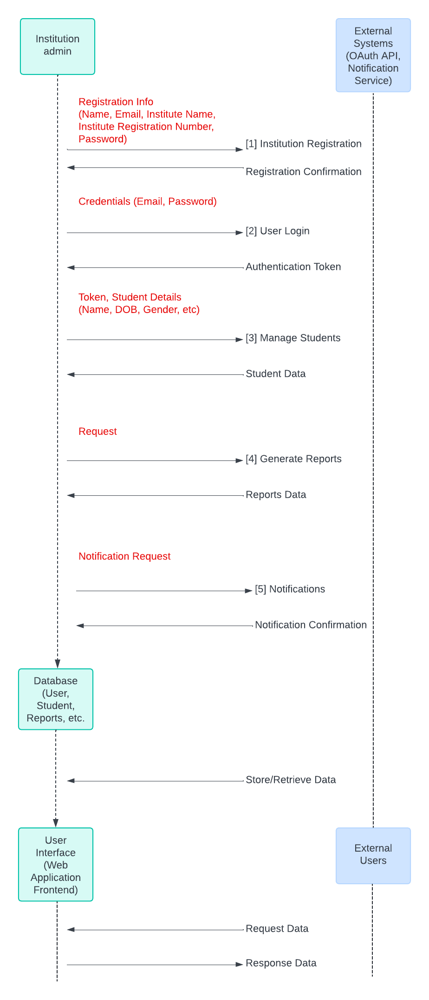

  
_Note: A MERN assignment project / For study purposes only / Not offered as an official product_

**Team**: a solo project by Manoj Kumar

# Deployment Summary

**Launched website** 🚀
- https://studentdb.online

**Production deployment** 
- Client/Frontend: https://studentdbonline.netlify.app/  
- Server/backend: https://studentdb-server.onrender.com

**GitHub Repositories**  
- Client/Frontend: https://github.com/emanoj1/studentdb-client  
- Server/Backend: https://github.com/emanoj1/studentdb-server 

### Video Walk-thru 📺
Check out the full functionalities & features of the website! 👇 

**Kanban board** 👉  [LIVE web view](https://circular-mask-82d.notion.site/T2A3-Assignment-e11875eb787e4311a4e1a6471da0347d)

---
### CONTENTS
_Note: "R" as in "R1, R2, etc" denotes the word, "Requirement"._
### PART-A
- [R1. Description of website](#r1-description-of-website)
- [R2. Dataflow Diagram](#r2-dataflow-diagram)
- [R3. Application Architecture Diagram](#r3-application-architecture-diagram)
- [R4. User Stories](#r4-user-stories)
- [R5. Wireframes for multiple standard screen sizes](#r5-wireframes)
- [R6. Kangan Board](#r6-kanban-board-screenshots)

---

### PART-B
- [R1. Tech stack used](#r1-tech-stack-used)
- [R2. Well designed code](#r2-well-designed-code)
- [R3. Employing a source control methodology](#r3-employing-a-source-control-methodology)
- [R4. Ability to work in a team](#r4-ability-to-work-in-a-team)
- [R5. A working application that meets client & user needs](#r5-a-working-application)
- [R6. Deploying the application to a cloud hosting service](#r6-deploying-the-app-to-a-cloud-hosting-service)
- [R7. An application with an intuitive user interface](#r7-an-application-with-an-intuitive-user-interface)
- [R8. Evidence of user testing](#r8-evidence-of-user-testing)
- [R9. Utilising a formal testing framework](#r9-utilising-a-formal-testing-framework)
- [R10. URL to the deployed website](#r10-url-to-the-deployed-website)
- [R11. GitHub repositories](#r11-github-repositories)

---

# PART A  

# R1 Description of website

#### Purpose
The primary purpose of **StudentDB**, the online student management system is to provide educational institutions with a comprehensive and efficient way to manage student data. This system will streamline administrative tasks, improve data accuracy, and enhance communication between the institution and its students. By leveraging modern web technologies, the system aims to offer a user-friendly experience that saves time and resources for educational institutions.

#### Functionality / Features
1. **Institution Registration**
   - A simple and secure registration process for institutions.
   - Fields: Person name, email, institute name, institute id, etc.

2. **Student Database Management**
   - A robust database to store and manage student details.
   - Fields: Name, date of birth, gender, phone, email, address, date of enrolment, area of study (for university students).
   - Features for adding, editing, and deleting student records.
   - Search and filter capabilities to easily find specific student information.

3. **Homepage**
   - Showcases the features and benefits of the product.
   - Includes a clear call-to-action for institutions to sign up and start using the product.
   - Attractive and informative design to engage visitors.

4. **About Page**
   - Provides detailed information about the product, its development, and the team behind it.
   - Explains the mission and vision of the student management system.

5. **Contact Page**
   - Easy-to-use contact form for inquiries and support.
   - Contact details for direct communication.

#### Target Audience
The primary target audience for this online student management system includes:
- Schools (primary and secondary)
- Colleges
- Universities
- Other educational institutions that require a systematic way to manage student information.

#### Tech Stack
The development of the web app will utilize the MERN tech stack, which includes:
- **MongoDB**: For the database to store student and institution data.
- **Express.js**: For the back-end server to handle API requests and manage data transactions.
- **React.js**: For the front-end, providing a responsive and interactive user interface.
- **Node.js**: For the server-side runtime environment, ensuring efficient handling of concurrent operations.

### Detailed Description

StudentDB, the online student management system is designed to simplify and enhance the way educational institutions handle student information. The website will feature a professional and intuitive design, ensuring ease of use for both administrators and users.

**Homepage**
The homepage will serve as the first point of contact for potential users. It will feature an engaging design that highlights the key features and benefits of the system. Institutions will find a straightforward link to register and begin utilizing the platform. The homepage will also feature testimonials and success stories to build trust and credibility.

**About Page**
The about page will provide comprehensive information about the student management system. It will detail the product's origins, development process, and the team behind it. This page will also communicate the system's mission to improve administrative efficiency and data accuracy for educational institutions.

**Contact Page**
The contact page will offer multiple ways for users to get in touch with the support team. It will feature a contact form for general inquiries, as well as email contact details. This ensures that institutions can easily seek assistance and provide feedback.

**Institution Registration**
A secure and user-friendly registration process will allow institutions to sign up quickly. By providing essential details such as the person’s name, email, and institute name, the system will create a unique profile for each institution, enabling them to manage their student data efficiently.

**Student Database Management**
The core functionality of the system lies in its ability to manage student information. The database will be designed to store a wide range of student details, from personal information to academic records. Administrators will be able to add new students, update existing records, and remove outdated information with ease. Advanced search and filtering options will help users quickly find specific student data.

Overall, **studentDB** aims to become an indispensable tool for educational institutions, offering a seamless and efficient way to handle student information while leveraging the powerful capabilities of the MERN tech stack.

[Back to top](#deployment-summary)

# R2 DATAFLOW DIAGRAM

To begin with, let's have a look at the **standard control workflow** before we present the detailed dataflow diagram, to get a top-level view of the system:

**Entities**:
<ol>
<li>Institution</li>
<li>Admin</li>
<li>System Database</li>
</ol>

**Processes**:
<ol>
<li>Institution Registration</li>
<li>Student Data Management</li>
<li>Website Navigation</li>
</ol>

**Data Stores**:
<ol>
<li>Student Database</li>
<li>Institution Database</li>
</ol>

#### Top level diagram   

#### Detailed diagram   

### DATAFLOW DIAGRAM - Detailed Processes

The below detailed DFD provides a clear overview of the data flow within the system, specifying the type of data being passed around in each process.

**The Overall System**

Each block diagram below represents a distinct functionality of the above mentioned system. 

**Overview**  
Institution Admin submits registration information (Name, Email, Institute Name, Institute Id).  
The system validates and stores the information in the database.  
A confirmation email is sent to the admin.

**Purpose**  
The institution registration process allows educational institutions to create accounts on the platform. It collects essential information to authenticate and set up profiles for these institutions.  

**Functionality**  
Data Collection: The registration form collects the institution admin's name, official email, institution name, registration number, and a password.  
Validation and Storage: The information provided is validated to ensure it meets the system's requirements (e.g., valid email format, strong password) and then stored securely in the database.  
Immediate Access: Once registered, the institution admin can immediately access the system to manage student data, without the need for email confirmation.  

**Technical Implementation**  
Database Operations: Uses CRUD operations to create a new institution record in the database.  
Security Measures: Passwords are hashed before storage to enhance security.  

**Overview**  
Institution Admin submits login credentials (Email, Password).  
The system authenticates the user and generates an authentication token.  

**Purpose**  
The user login process authenticates institution admins when they attempt to access their accounts, ensuring that only authorized users can manage sensitive student information.  

**Functionality**  
Credentials Verification: Admins log in using their registered email and password.  
Authentication Token: Upon successful authentication, the system generates an authentication token which is used for session management and securing subsequent requests.  
Security Features: Includes measures to prevent unauthorized access and attacks such as brute force.  

**Technical Implementation**  
Session Management: Typically involves generating a secure token (e.g., JWT) that maintains user state across requests.  
Security Checks: Might include rate limiting and automatic lockout after several failed attempts.  

**Overview**  
Institution Admin sends student details (Name, DOB, Gender, etc.) along with the token.  
The system processes the student data, storing or retrieving it from the database.  

**Purpose**  
This process allows institution admins to add, update, delete, and retrieve detailed information about students, maintaining a robust database of student records.

**Functionality**  
CRUD Operations: Admins can create new student records, read existing ones, update details, or delete records as needed.  
Search and Filtering: Provides functionality to search for specific students or filter lists based on criteria like enrollment date or area of study.  
Data Integrity: Ensures that all student information is accurately recorded and maintained.  

**Technical Implementation**  
Database Transactions: Ensures atomic operations for data integrity and error handling.  
Input Validation: Protects the system from invalid or harmful input.  

**Overview**  
Institution Admin requests reports.  
The system processes the report request, retrieves data from the database, and returns the report data.  

**Purpose**  
This feature allows the generation of reports based on the student data available. These reports can help admins track enrollment, performance, and other metrics over specified periods.  

**Functionality**  
Report Customization: Admins can generate reports based on various criteria (e.g., time frames, specific programs).  
Data Aggregation: The system aggregates data from multiple records to compile comprehensive reports.  
Export Options: In phase 2 of this project in the future, we can look at the ability to export reports in various formats like PDF or Excel.  

**Technical Implementation**  
Data Analysis Tools: May use SQL queries or specialized software libraries to analyze and format data.  
Asynchronous Processing: Large report generation tasks may be processed in the background to avoid blocking the main application workflow.  

**Overview**  
Institution Admin sends a notification request.  
The system processes the request and sends the notification via an external notification service.  
The "Notifications" process in the system serves a key role in communicating timely and relevant information to institution admins or other relevant stakeholders.  

**NOTE**: Majority of the notification features (mentioned below) can be implemented in the future, as a part of phase 2. For Phase 1, we will have simple & relevant notifications only. But, we are presenting all the possibilities for you to get an idea.

**Purpose**

1. **Timely Alerts**: The notification system can alert institution admins about important events or statuses within the application. For example, if there is an update to a student's records, or a deadline approaching for report submissions, the system can automatically notify the admins.

2. **Actionable Reminders**: Notifications can serve as reminders for actions that need to be taken. For instance, reminding admins of incomplete registration processes, pending approvals, or actions required after a certain trigger within the system.

3. **Error Alerts**: If there are errors in the system, such as failed data submissions or conflicts in schedules, notifications can alert the admin immediately, allowing for swift resolution.

4. **System Updates**: When there are updates or changes in the system, notifications can inform all users of these changes. This might include new features, maintenance times, or changes in terms or policies.

5. **User Engagement**: Regular notifications can help keep users engaged with the system, prompting them to return to the platform regularly, which can enhance user retention and satisfaction.

### Functionality of Notifications

- **Triggered by Specific Events**: Notifications are typically triggered by specific events within the system. For example, when a new student is enrolled, a notification might be sent to the admin to review and confirm the details.

- **Customizable**: Depending on the system's design, notifications can often be customized by the admins to control what types of notifications they receive, how often they receive them, and through what channels (e.g., email, SMS, system pop-ups).

- **Automated**: The notification process is usually automated. Once the triggers and types of notifications are defined, the system can handle the sending of these alerts without manual intervention.

- **Integrated with External Services**: To send notifications, especially through email or SMS, the system may integrate with external notification services or APIs that handle the actual delivery of these messages.

### Technical Implementation

- **External Notification Services**: For email and SMS, services like Twilio for SMS or SendGrid for email might be used. These services provide reliable delivery and management of notification services.

- **In-System Notifications**: For notifications that appear within the web application, technologies like WebSocket can be used for real-time communication, or simpler polling mechanisms could be employed depending on the application's requirements.

- **Database Monitoring**: The system will likely have mechanisms to monitor changes in the database or specific tables that trigger notifications. This could be implemented via database triggers or by application logic that checks for certain conditions during data processing.

By incorporating a robust notification system, the student management platform can enhance its interactivity and responsiveness, significantly improving the user experience for institution admins. This system can keep users well-informed and engaged, making the platform more effective and efficient.

### Key Points from the Dataflow Diagram
Each process (Institution Registration, User Login, Manage Students, Generate Reports, Notifications) is a separate block that interacts with the database and external systems.  
The user interface communicates with each of these processes independently based on the user's actions.  
Data such as registration info, credentials, student details, report requests, and notifications are passed between the user interface and the respective processes.  
Each process communicates with the database to store and retrieve relevant data.  
External systems are used for tasks like generating authentication tokens and sending notifications.  

This comprehensive DFD shows how the data flows between the different parts of the system, providing a detailed overview of the interactions and data exchanges within the application.  

[Back to top](#deployment-summary)

# R3 APPLICATION ARCHITECTURE DIAGRAM

Below is a detailed Application Architecture Diagram for the online student management system using the MERN stack.

#### Layers:
1. **Client Side (Frontend)**
   - Browser (React.js Application)
2. **Server Side (Backend)**
   - Express.js Server
3. **Database**
   - MongoDB

### Components:
1. **Client Side**
   - React Components (Pages, Forms, Navigation, etc.)
   - Redux (State Management)
   - Axios/Fetch (HTTP Client)

2. **Server Side**
   - Express.js Server
   - REST API Endpoints
   - Middleware (Authentication, Validation, Error Handling)
   - Controllers
   - Services

3. **Database**
   - MongoDB
   - Mongoose (ORM)

### Explanation:

#### Client Side (Frontend)
- **React Components**: These are the building blocks of the user interface, including pages (Home, About, Contact), forms (Institution Registration, Student Data Management), and navigation components.
- **Redux Store**: Used for managing the application state, ensuring a predictable and consistent state across the app.
- **Axios/Fetch**: HTTP clients for making API calls to the backend server.

#### Server Side (Backend)
- **Express.js Server**: The core of the backend, handling incoming HTTP requests and routing them to the appropriate endpoints.
- **Routes**: Define the API endpoints (e.g., /register, /students) and link them to controllers.
- **Middleware**: Includes authentication (e.g., JWT), validation, and error handling to process and secure the requests.
- **Controllers**: Handle the logic for each endpoint, interacting with the services to perform CRUD operations.
- **Services**: Business logic and interaction with the database, abstracting the database operations from the controllers.

#### Database
- **MongoDB**: The NoSQL database for storing institution and student data.
- **Collections**: Logical groupings of documents (e.g., Institutions, Students).
- **Documents**: Individual records in the collections.
- **Mongoose**: An ORM for MongoDB, providing a schema-based solution to model the application data and interact with MongoDB.

This architecture ensures a clear separation of concerns, with the frontend and backend interacting through well-defined API endpoints, and the database being managed through an ORM for ease of use and maintenance.  

[Back to top](#deployment-summary)

# R4 USER STORIES

_Art credit: drawn by Manoj Kumar_

  

**John Citizen**:   
---
**Role**: Institutional admin at a local private institute  

**Work area**: Manages all student records of his institute   

**Location**: Sydney, Australia  

**Background**: John has been a part of the educational community for 17 years, and has played a key role in keeping student data organized and secure.  

**Goals**: 
<ul>
<li>John wants a system where student data management isn't restricted to his local machine, and has the ability to be accessed across computers and devices nationally.</li> 
<li>He also wants to signup some of his colleagues to use the new system so they can help him with student data entry and edits.</li>
</ul>

**Challenges**: 
<ul>
<li>Prior to using StudentDB, John had been using a software set locally on his machine. This means other members of his team did not have access all the time and there was a danger of data getting lost should his computer crash.</li> 
<li>It was an expensive software and very clunky to use, and took a long time to complete a student entry. There were many fields on the form he felt were unncessary and hence adding to his workload.</li>
<li>Basic computing and internet skills only. </li>
</ul>

**Tech skills**: Although not an IT professional, John is often meeting up with the institute's tech team to understand how technology & digital products can be used to make his work better and modern.  

**Why studentDB**:
<ol>
<li>Cheaper to use as it will be a subscription model unlike softwares that have high purchase and maintenance costs.</li>
<li>Data stored in the cloud using MongoDB, a highly secure & robust online database system.</li>
<li>The student data entry forms are simple to use, and asks only for relevant information.</li>
<li>studentDB is in the cloud, and hence easily accessible anywhere and by other members of his team on their own devices.</li>
<li>Begin using the app quickly, as it involves only user signup to get started. No installation or training required!</li>
</ol>

  
**Jane Appleseed**:  
---

**Role**: a casual web browser/user checking out the website.

**Work area**: Works in the software industry and keen to see what interesting products are in the market.  

**Location**: Ohio, U.S.A  

**Background**: Jane's loves anything IT, internet and software. One day she hopes to launch her own web application and quit her demanding 9-5 job! Till then, she is happy to browse the WWW, and see what new internet products and services are launching in the market. Recently, she saw an ad featuring **studentDB** in the local newspaper, and has been keen to check it out. Her parents work for the local school as teachers, and she is wondering if the product can be useful for the school, and perhaps she can be the freelancer consultant to bring it to them!!

**Goals**: 
<ul>
<li>Understand what studentDB offers, features & benefits and how it works.</li> 
<li>Share her understanding with her parents who work at the local school, and perhaps pitch it to the relevant school authorities.</li>
</ul>

**Challenges**: 
<ul>
<li>Education industry isn't her forte (but she understands tech!)</li> 
<li>She has never used any data management software before, so her experience is limited.</li> 
</ul>

**Tech skills**: Well-versed in the production of websites & software, understands how internet works, and comfortable with general technical matters!  

**Why studentDB**:
<ol>
<li>The ad she saw in the paper looked trustworthy and legit. </li>
<li>She is curious to know how an online database management works.</li>
</ol>

--- 
### User Story - Institution Registration and Management

1. **As John, the Institution Admin, I want to register my institution so that I can start using the student management system.**
   - **Acceptance Criteria:**
     - The registration form collects the person’s name, email, and institution name.  
     - The institution’s data is stored in the database.  

2. **As John, the Institution Admin, I want to log in to the system so that I can manage my institution’s student data.**
   - **Acceptance Criteria:**
     - The login form collects the email and password.
     - Authentication is handled securely.
     - Successful login redirects to the admin dashboard.

### User Story -  Student Data Management

3. **As John, the Institution Admin, I want to add new student details so that I can keep track of all students enrolled in my institution.**
   - **Acceptance Criteria:**
     - A form to add student details (name, date of birth, gender, phone, email, address, date of enrolment, area of study).
     - Validation of mandatory fields.
     - Successful submission stores the student’s data in the database.

4. **As John, the Institution Admin, I want to edit existing student details so that I can update any changes or correct mistakes.**
   - **Acceptance Criteria:**
     - An interface to search for and select a student.
     - A form pre-populated with the student’s current details.
     - Ablity to make the required changes
     - Successful submission updates the student’s data in the database.

5. **As John, the Institution Admin, I want to delete student details so that I can remove records of students who are no longer enrolled.**
   - **Acceptance Criteria:**
     - An interface to search for and select a student.
     - Successful deletion removes the student’s data from the database.

6. **As John, the Institution Admin, I want to search and filter student details so that I can easily find specific student information.**
   - **Acceptance Criteria:**
     - A search bar to search by student name, email, or other attributes.
     - Display of search results in a list format.

### User Story -  Website Navigation and Information

1. **As Jane Appleseed, a potential user, I want to visit the homepage so that I can understand the features and benefits of the student management system.**
   - **Acceptance Criteria:**
     - A well-designed homepage showcasing key features and benefits.
     - Clear call-to-action buttons for sign-up and login.

2. **As Jane, a potential user, I want to visit the About page so that I can learn more about the product and the team behind it.**
   - **Acceptance Criteria:**
     - An About page with detailed information about the product’s mission, vision, and development.
     - Information about the team behind the product.

3. **As Jane, a potential user, I want to visit the Contact page so that I can reach out for inquiries or support.**
   - **Acceptance Criteria:**
     - A contact form for submitting inquiries.
     - Display of contact details for direct communication.

### User Story -  User Account Management

10. **As John, an Institution Admin, I want to reset my password so that I can regain access if I forget it.**
    - **Acceptance Criteria:**
      - A password reset option on the login page.
      - Successful reset allows login with the new password.

11. **As John, an Institution Admin, I want to update my account details so that my profile information is always current.**
    - **Acceptance Criteria:**
      - A form to update account details (e.g., name, email, password).
      - Successful submission updates the account information in the database.

### User Story -  Security and Permissions

12. **As John, an Institution Admin, I want my data to be secure so that unauthorized users cannot access it.**
    - **Acceptance Criteria:**
      - Implementation of secure authentication and authorization mechanisms.
      - Encryption of sensitive data.
      - Regular security audits and updates.

These user stories cover the primary functionalities and interactions for the system, ensuring the needs of the institution administrators and potential users are met.

[Back to top](#deployment-summary)

# R5 Wireframes

The website is designed in a way to keep content and design minimalistic, and keep it easy for the user. It will use 1-2 fonts and 1-2 colors as well.  

Below are the wireframe diagrams of the app for multiple standard screen sizes using Figma:

### (1) Homepage - Desktop

The HOMEPAGE on desktop features all content placed left to right and from top to bottom. The navigation bar contains the logo to the left, and to the right are all the various links to the different pages. The nav bar items takes the user to their own pages, namely the About page, the Contact page, and finally the Login and Registration pages.  

Below the navigation bar are content in 3 sections:
<ul>
<li>the hero section featuring an image, an elevator pitch of the app and a call to signup</li>
<li>the Features section displays 3 key benefits of the app along with an icon</li> 
<li>a testimonial section containing reviews from other users</li>
</ul>

The page finishes with a footer bar, which contains Terms & Conditions and other admin related links and text.

### Homepage - Tablet

The HOMEPAGE on the tablet displays content top to bottom, with a collapsible nav bar. All the content are a little compressed and sequentially placed to fit on the page.

### Homepage - Mobile

The HOMEPAGE on the mobile displays content top to bottom, with a hamburger menu for the navigation bar.

### (2) About page - Desktop

The ABOUT page talks about the history and purpose of the web app, followed by the mission & vision statements of the company. It will also feature the team, and their bio. Like the Homepage, the About page also has a header navigation bar and a footer bar. All content are place left to right, and top to bottom. The page also takes a sectional approach with each block of content placed in its own section.

### About page - Tablet

The tablet view features content placed top to bottom, with a collapsible navigation bar, and a vertical carousel for the team section.

### About page - Mobile

The mobile view has all content arranged horizontally, and uses a hamburger menu for the nav bar. The team section uses a vertical carousel.

### (3) Contact page - Desktop

The CONTACT page will feature a form for user data and comments entry. The form submission will send an email to the website owner. The plan is to use a 3rd party form widget (e.g: Tally, Paperform etc), which is implemented via a Javascript code.

### Contact page - Tablet

### Contact page - Mobile

### (4) Institute Registration page - Desktop

Institution Registration is where a nominated person from an educational institute signs up to use the site. It asks for key information like person name, email id, Institution name and ID, and password. Once signed up, he can immediately access the dashboard and begin his work. Once registered, the page will redirect to the LOGIN page, where he enters the credentials to login.

### Institute Registration page - Tablet

### Institute Registration page - Mobile

### (5) Login page - Desktop

The Login page features fields that helps a registered user login to the site. The required details are - registered email and password he set during the registration stage. Once logged in, he is taken to the Dashbard page. If details entered are incorrect, the system will prompt him to enter the right info, or he can reset his login details using the Forgot Password link.

### Login page - Tablet

### Login page - Mobile

### (6) Admin (the user) Dashboard page - Desktop

The Dashboard for the user is a simple one featuring key action buttons on the left panel. The links are: 
<ul>
<li>Student List which features all students who have been entered on the system</li>
<li>Add Students page where the user can enter new students</li>
<li>the Admin settings where the admin user can change his profile, including password.</li>  
</ul>  

The Student List page also has the option to **Edit** student details or **Delete** a student from the database.

### Admin (the user) Dashboard page - Tablet

### Admin (the user) Dashboard page - Mobile

### (7) Student Management page - Desktop

This page shows all the students in the database, with the option to Edit student details or delete a student.

### Student Management page - Tablet

### Student Management page - Mobile

### (8) Add/Edit student page - Desktop

The Add-Edit page is loaded when the admin user clicks on the Edit button found against a student in the Student List page. The loaded page allows the admin user to update all data of a student in the database.

### Add/Edit student page - Tablet

### Add/Edit student page - Mobile

### (9) Admin Settings page - Desktop

The Admin Settings page gives the institute admin user to change any of the details of the insitutute he belongs to (institute name, Id etc), his own details (name, email etc) and also the login details (password update).

### Admin Settings page - Tablet

### Admin Settings page - Mobile

# R6 Kanban board screenshots

The various to-do tasks for the preparation of this project documentation was managed via a 3-lane Kanban board using **Notion**. Notion is a productivity and note-taking web application. It is very similar to the propular apps like Trello and Evernote.   

Since the web app project involved 2 separate work - the documentation and the building of the app, I have created 3 Kanban boards within a single project page on Notion - the documentation (Part A), the Client side (Part B) and the Server side (Part B).

The Kanban board features 3 swimlanes - **Not Started**, **In Progress** and **Done**. All the required activities are first set as tasks in the **Not Started** column, and when the task is to be actioned, it is moved to the **In Progress** column. Once the task is completed, the task card is moved into the **Done** column.

  

Click to check out [the Kanban board LIVE on a weblink here!](https://circular-mask-82d.notion.site/T2A3-Assignment-e11875eb787e4311a4e1a6471da0347d)

[Back to top](#deployment-summary)

---
# PART B

# R1 Tech stack used

The web app was developed using the MERN tech stack.

**MongoDB**: For the database to store student and institution data.  
**Express.js**: For the back-end server to handle API requests and manage data transactions.  
**React.js**: For the front-end, providing a responsive and interactive user interface.  
**Node.js**: For the server-side runtime environment, ensuring efficient handling of concurrent operations.  

# R2 Well designed code
The code was written keeping in mind the industry best practices and code organization. 
- Separated modules were used in both frontend and backend to manage each function/focus. Not only does this help the code arrangement look neat, but it also aides in quick troubleshooting. 
- Care was also taken to follow DRY (Don't Repeat Yourself) coding principles.
- An extensive list of libraries were used in this project for both the client and server sides:

### Server-Side Libraries (in studentdb-server):  
**express**: A web framework for Node.js to create server-side applications.  
**mongoose**: An Object Data Modeling (ODM) library for MongoDB and Node.js.  
**bcryptjs**: A library to hash passwords.  
**dotenv**: A module to load environment variables from a .env file.  
**jsonwebtoken**: A library to generate and verify JSON Web Tokens (JWT) for authentication.  
**body-parser**: Middleware to parse incoming request bodies in a middleware before handlers.  
**cors**: Middleware to enable Cross-Origin Resource Sharing (CORS) with various options.  
**nodemon**: A tool that helps develop Node.js applications by automatically restarting the server when file changes are detected.  

### Dev Dependencies (for testing):  
**jest**: A testing framework for JavaScript.  
**supertest**: A library for testing Node.js HTTP servers using a high-level API.  

### Client-Side Libraries:  

**@testing-library/react**: A library for testing React components.  
**react-router-dom**: A library that enables routing in React applications.  
**axios (used in tests)**: A promise-based HTTP client for the browser and Node.js.  

# R3 Employing a source control methodology

GitHub was the chosen tool to manage all source control, and it was made easier using GitHun Desktop.   
2 repositories were used - one for the frontend and another for the backend.

You can view the repos here:👇    
**Client/Frontend**: https://github.com/emanoj1/studentdb-client  
**Server/Backend**: https://github.com/emanoj1/studentdb-server  

Branches were used for specific functions, and when everything seemed to be working, they were pushed across to the main.

All changes were checked extensively on the localhost before their push to the `main` branch. 

# R4 Ability to work in a team

This was a solo project, and hence the owner of this repo (Manoj Kumar) was THE team! However, I worked with a team mindset using traits such as patience, delegating work to different days (rather than a person), and going over and above to provide as much information & work that can help this project succeed.  

In terms of work management, I used a Kanban board on [Notion](https://notion.so), where I separated the work into Part-A and Part-B, and assigned swimlanes (not started, in progress, done) to manage the work, as what I would've done if we had a team managing different aspects of the web app design.

In this way, I was able to demostrate:
- the use of a recognised project management methodology
- the use of a recognized task delegation methodology  

# R5 A working application

The initial development phase of the application focused on "soft launching" on the localhost, where all the working and key functions of the web app was showcased **minus the visual design**:

**Logged-out State**
- Home page with placeholder content
- An About page with placeholder content
- A Contact page with placeholder content
- A working Login page with basic Username and Password fields
- A Registration page with basic fields (Name, Email, Password, Institute Name & ID#)
- A navigation bar across all pages with links to the above pages
- A sample logo

**Logged-in state**
- The Admin landing page (once logged-in) presented basic student record stats
- Also, featured the links to Add Student, Edit Student, Delete Student and Update Admin records.
- Logout button

All of the above was styled in minimalist colors (standard black & white). 

All the API endpoints were tested using [Insomnia](https://insomnia.rest) to ensure everything was working.

The aim of the providing a "working application" was to show the "client" that all the key functions of the app was working and to check if anything required an update. Once all the issues were sorted and matched the project scope perfectly, the styling commenced towards the backend phase of the project.

[Back to top](#deployment-summary)

# R6 Deploying the app to a cloud hosting service

Once all the key features (_page navigation, login, registration, password resets, student CRUD operations_) were working perfectly, all styling completed (_colors, fonts_) and all content added to the respective pages, the project moved to its deployment phase to a cloud hosting service.
- the frontend was deployed on [Netlify](https://netify.com)
- the backend was deployed on [Render](https://render.com)
- the database was deployed on [MongoDB](https://mongodb.com)

Below are the deployed links:
- Deployed production (Client/Frontend): https://studentdbonline.netlify.app/
- Deployed production (Server/backend): https://studentdb-server.onrender.com

Below are some views from their dashboards:

**1. Deployment on Netlify (the frontend)**

**2. Deployment on Render (the backend)**

**3. Deployment to MongoDB (the database)**

**4. An example collection on MongoDB**

_Security Answers hidden from view on purpose._

# R7 An application with an intuitive user interface

The website features a minimalist design for both is style and functions. Only few colors are used for section separation, the standout of the navigation bar, and bright buttons for key user operations.

### Homepage

The Homepage features the following prominently:
- The nav bar with items to navigate to.
- The Login & Register buttons are bright & boxed for quick spotting.
- A hero section in the beginning with an elevator pitch
- 6 sections showcasing the features & benefits of the site, images from the dashboard for the user to see how it looks "inside" or the backend before signing up, a video tour of the full website, testimonials from signed-up users and finally a link to the contact page.

### Registration page

This is the most important page! Registration deals with collecting the institution admins signup details, as well as 3 security answers to assist in password reset.

The page is styled with a modern & youthful focus, using round-edged and shadowed input fields, and images.

### Login page  

The LOGIN page is a clutter-free page with 4 important items on it:
- Email field
- Password field
- The Login submit button
- A `Forgot Password` link to help reset the password

### Forgot Password page  

This page helps a user log back in by setting up a new password provided he can answer the security answers he supplied when signing up. 

### Admin Dashboard - landing page  

This is the first page you see when you login to the site. It features a menu to the left that deals with the various CRUD operations and there is a logout button the top-left.

### Admin Dashboard - Student List page  

This page loads all the students in the database of that specific institute. it also features an Edit and a Delete button for student row.

### Admin Dashboard - Add Student page  

As the name implies, the Add Student page is the place to begin your data entry work of adding students. Only the main information is required of the student, and upon submitting the form, it stays on the page to help you continue with the data entry work. If you want to see the student entered, you can navigate to the Student List page.

### Admin Dashboard - Admin Settings page  

On this page, the logged-in Institute Admin can change their details, whether it be their name, email id, institute details, the security answers or their password. By default, it populates their name, contact email and institute details. Security related info is not displayed.

### Contact Us page  

The Contact page uses a 3rd widget [Tally.so](https://tally.so) which is embedded to the page as an iFrame widget. Upon submission of content from this page, the information reaches the web app owner by email. Using 3rd party widget is far easier to implement and maintain compared to building a custom form on the page.

### LIVE Chat pop-up

All pages of the website also feature a LIVE Chat bubble, also a 3rd party widget from [Tawk](https://tawk.to):

[Back to top](#deployment-summary)

# R8 Evidence of user testing

#### What is it?
Every item on the website was manually checked to ensure that they were working as intended. The process starts with checking them on the development environment (localhost) and then checking them again once they are in production/deployed state.

So, the one document captured both the development and production statuses.

#### Where is it captured?
An excel document was maintained which listed all the items to be tested for each page of the website. This is the format:
- **Test #**: This is a serial number assigned to the test, as simple as 1,2,3, etc.
- **Testing Item**: A short info on what is going to be tested.
- **Definition**: A short info on what this specific test is about.
- **Input Command**: What should you action to get the test underway.
- **Expected Output**: What the expected result should you be when an action is performed.
- **Actual Result**: What was the result in reality you observed once the test was actioned.
- **Test Status**: The test is marked as PASSED or FAILED based on the outcome.
- **Tested Date**: The date on which the test was carried out.

Then, as the test begins the observations are entered into the appropriate columns.

If a test has failed, then the web developer goes back to the source code to troubleshoot, till the result is a PASSED STATUS.

#### How was the information/observation organized?
The excel document maintained multiple sheets (5 sheets), each one capturing a specific set of tests:

- **Device View**: Testing the bahaviour of the website for responsiveness (desktop, tablet & mobile).
- **Main Page Components**: Testing all the functions and features of the website (login, authentications, navigation to all pages, etc).
- **Navigation Bar**: Testing the navigation bar for responsiveness and how it behaves in logged-out state and logged-in state. 
- **Admin Dashboard**: Testing to see how the Admin (logged-in state) pages work (stats, CRUD operations, etc).
- **LIVE Chat Widget**: Test if the LIVE chat widget is working or not.

#### Evidence of the full testing

Below are screenshots of the Excel document showing the 5 main testing areas explained above:  

### Manual unit test website responsiveness  

### Manual unit test - all main functions  

### Manual unit test on the Navigarion bar  

### Manual unit test on the Admin Dashboard  

### Manual unit test for the presence of the LIVE Chat widget  

[Back to top](#deployment-summary)

# R9 Utilising a formal testing framework

**Jest** is a popular testing framework for JavaScript applications, particularly well-suited for testing React applications. It provides a way to test our code and ensure that it works as expected.  

A total of 7 tests were done, 6 on the Client-side and 1 on the Server-side.  

Below are the Terminal results for each of the above tests:

### Client-side

**Test 1 - the Register button**  
  
This is the Jest test for the Register button on the navigation bar.  

**Test 2 - the Registration submission function**  
  
This is the Jest test for the Registration button.  

**Test 3 - the Login function**  
  
This is the Jest test for the Login button.  

**Test 4 - the Forgot Password function**  
  
This is the Jest test for testing the Forgot Password button function.  

**Test 5 - the Student List function**  
  

**Test 6 - the Contact form widget**  
  
This is the Jest test for the Contact page. The aim is:  
- To test - the presence of the iFrame element on the Contact page  
- To test - the correctness of the src attribute of the iFrame  

### Server-side

**Test 6 - Check user login**  
  

This test requires 2 steps:
- seed a test data (user details) into MongoDB
- test the login with the new details

A separate test MongoDB database & collections was created for it to work.

[Back to top](#deployment-summary)

# R10 URL to the deployed website

The web app on its own domain is available here: [studentdb.online](https://studentdb.online)

In order to test the functionalities of the website in a logged-in state and test teh CRUD operations, I highly recommend you sign-up to the site, login with your new details, add some students, edit & delete them, and even check out updating your signup information as well!  

If that's too much work, you can use the below test logins:  
username: `tomg@onlymusicschool.com`   
password: `TomY2024*`  

# R11 GitHub repositories

The repositories are:   
Client/Frontend: https://github.com/emanoj1/studentdb-client  
Server/Backend: https://github.com/emanoj1/studentdb-server 

GitHub Desktop was used for the timely & consistent management of the repositories. Branches were used, which were then merged into `main` once everything was working.

[Back to top](#deployment-summary)

---

# Getting Started with Create React App

This project was bootstrapped with [Create React App](https://github.com/facebook/create-react-app).

## Available Scripts

In the project directory, you can run:

### `npm start`

Runs the app in the development mode.\
Open [http://localhost:3000](http://localhost:3000) to view it in your browser.  

The page will reload when you make changes.\
You may also see any lint errors in the console.

### `npm test`

Launches the test runner in the interactive watch mode.\
See the section about [running tests](https://facebook.github.io/create-react-app/docs/running-tests) for more information.

--- 
[Back to top](#deployment-summary)

### THE END.